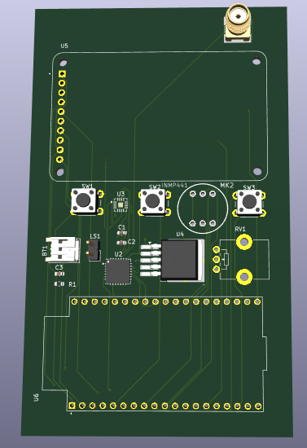
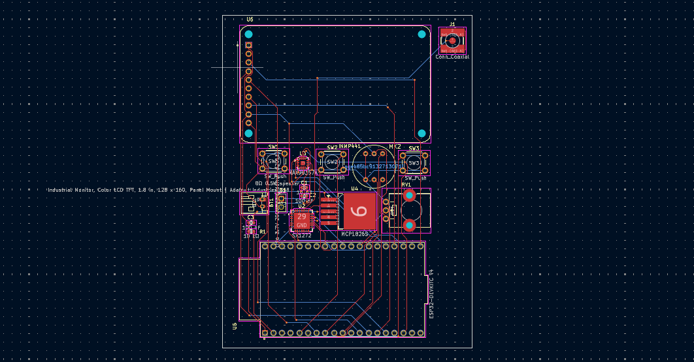
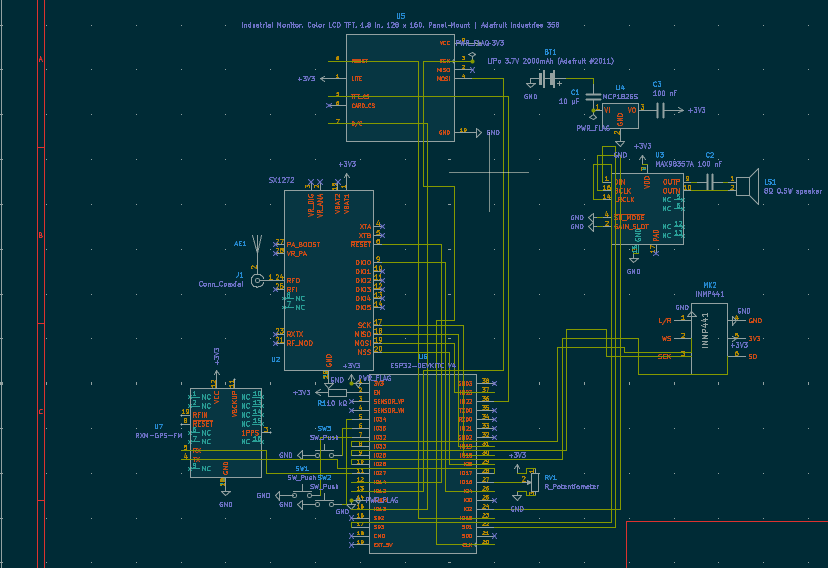

# ESP32_Smart_Walkie_Talkie

This is a smart walkie talkie using an ESP32 development board. It functions as a walkie talkie. It uses a LoRa module to send radio signals 1 km+, and has smart features such as a low battery alert and a RSSI Signal Bar. The device features a custom-designed 3D-printed enclosure that houses all the electronics and provides a professional, handheld form factor.

I made this project to allow people to contact each other where cellular data wasn't an option. It would be especially helpful in a remote environment such as a forest, to talk with somebody, or broadcast your signal in case of emergencies. I wanted my first Blueprint project to be useful to the everyday public.

## Images

## Bill of Materials (BOM)

| Name | Qty | Description | Unit Price | Total Price | URL |
|------|-----|-------------|------------|-------------|-----|
| 3.7V 103450 Polymer Lithium Battery, 2000 mAh Rechargeable | 2 | BATTERY LITH-ION 3.7V 2AH | $8.26 | $16.52 | [AliExpress](https://www.aliexpress.us/item/3256802548415679.html?gatewayAdapt=glo2usa4itemAdapt) |
| 1.8'' TFT Full Color LCD Display (2pcs) | 1 | TFT LCD display | $6.44 | $6.44 | [AliExpress](https://www.aliexpress.us/item/3256808787979678.html?spm=a2g0o.productlist.main.8.3de96ad9Vkq08A&aem_p4p_detail=202511101756173413292387694210001186719&algo_pvid=8ea23c16-b5cd-4224-bf89-0f22588c9dab&algo_exp_id=8ea23c16-b5cd-4224-bf89-0f22588c9dab-7&pdp_ext_f=%7B%22order%22%3A%2293%22%2C%22eval%22%3A%221%22%2C%22fromPage%22%3A%22search%22%7D&pdp_npi=6%40dis%21USD%213.63%210.99%21%21%2125.68%216.98%21%402101dedf17628261771466106e807e%2112000051489768264%21sea%21US%210%21ABX%211%210%21n_tag%3A-29910%3Bd%3A17c82639%3Bm03_new_user%3A-29895%3BpisId%3A5000000187461913&curPageLogUid=IogOLCzfrTak&utparam-url=scene%3Asearch%7Cquery_from%3A%7Cx_object_id%3A1005008974294430%7C_p_origin_prod%3A&search_p4p_id=202511101756173413292387694210001186719_2) |
| Conn_Coaxial SMA KHD (5pcs) | 1 | Coaxial connector | $2.09 | $2.09 | [AliExpress](https://www.aliexpress.us/item/2255800008688086.html?spm=a2g0o.productlist.main.2.650e6f241hfe3B&algo_pvid=a27a1da0-1e72-43f2-bdd9-2193f2b7ee0b&algo_exp_id=a27a1da0-1e72-43f2-bdd9-2193f2b7ee0b-1&pdp_ext_f=%7B%22order%22%3A%2220%22%2C%22eval%22%3A%221%22%2C%22fromPage%22%3A%22search%22%7D&pdp_npi=6%40dis%21USD%212.09%210.99%21%21%212.09%210.99%21%40210337c117628215233961599e80a9%2110000000733483787%21sea%21US%210%21ABX%211%210%21n_tag%3A-29910%3Bd%3A17c82639%3Bm03_new_user%3A-29895%3BpisId%3A5000000187461913&curPageLogUid=HRgm0xYNEq4L&utparam-url=scene%3Asearch%7Cquery_from%3A%7Cx_object_id%3A4000195002838%7C_p_origin_prod%3A) |
| MAX98357A | 2 | Audio amplifier | $1.93 | $3.86 | [AliExpress](https://www.aliexpress.us/item/3256805196806369.html?src=google&pdp_npi=4%40dis%21USD%211.93%211.72%21%21%21%21%21%40%2112000032829876742%21ppc%21%21%21&gatewayAdapt=glo2usa) |
| 3W 8 ohm 2W speaker | 2 | Audio output device | $2.03 | $4.06 | [AliExpress](https://www.aliexpress.us/item/3256805513567413.html?spm=a2g0o.productlist.main.2.48b87118WnNtn8&algo_pvid=cfaf4f0d-6ae2-4e2c-9167-838115f1b312&algo_exp_id=cfaf4f0d-6ae2-4e2c-9167-838115f1b312-1&pdp_ext_f=%7B%22order%22%3A%22443%22%2C%22eval%22%3A%221%22%2C%22fromPage%22%3A%22search%22%7D&pdp_npi=6%40dis%21USD%212.02%210.99%21%21%2114.32%217.02%21%402101ef5e17628209327424906e3ecb%2112000044410928207%21sea%21US%210%21ABX%211%210%21n_tag%3A-29910%3Bd%3A17c82639%3Bm03_new_user%3A-29895%3BpisId%3A5000000187461913&curPageLogUid=1UQMMRe9NU44&utparam-url=scene%3Asearch%7Cquery_from%3A%7Cx_object_id%3A1005005699882165%7C_p_origin_prod%3A) |
| INMP441 | 2 | Omnidirectional microphone | $2.43 | $4.86 | [AliExpress](https://www.aliexpress.us/item/3256806131008765.html?spm=a2g0o.productlist.main.1.f68e3820pubLnc&algo_pvid=ead07b69-a23d-4e44-a26b-06d0663ad1f3&algo_exp_id=ead07b69-a23d-4e44-a26b-06d0663ad1f3-0&pdp_ext_f=%7B%22order%22%3A%22207%22%2C%22eval%22%3A%221%22%2C%22fromPage%22%3A%22search%22%7D&pdp_npi=6%40dis%21USD%212.42%210.99%21%21%2117.17%217.04%21%402101eecd17628211563285515e3713%2112000036737351755%21sea%21US%210%21ABX%211%210%21n_tag%3A-29910%3Bd%3A17c82639%3Bm03_new_user%3A-29895%3BpisId%3A5000000187461913&curPageLogUid=gpENJgXtYVrp&utparam-url=scene%3Asearch%7Cquery_from%3A%7Cx_object_id%3A1005006317323517%7C_p_origin_prod%3A) |
| ESP32-DEVKITC V4 | 2 | Microcontroller development board | $5.32 | $10.64 | [eBay](https://www.ebay.com/itm/376392617070?_trkparms=amclksrc%3DITM%26aid%3D1110006%26algo%3DHOMESPLICE.SIM%26ao%3D1%26asc%3D295489%2C295741%26meid%3Dda038105f19d42039a8843a7de189449%26pid%3D101224%26rk%3D2%26rkt%3D5%26sd%3D254803105402%26itm%3D376392617070%26pmt%3D0%26noa%3D1%26pg%3D2332490%26algv%3DDefaultOrganicWebV9BertRefreshRankerWithCassiniEmbRecall%26brand%3DUnbranded&_trksid=p2332490.c101224.m-1) |
| 915 MHz Meshtastic LoRa Antenna with RP or SMA Male 915MHz for LoRaWan Aerial | 2 | Antenna 915hz | $5.00 | $10.00 | [eBay](https://www.ebay.com/itm/154891841854) |
| [2-Pack] 3.7V USB Charger Cable SM-2P Plug Cable with LED Indicator | 1 | Recharging Unit for Battery | $3.98 | $3.98 | [Amazon](https://www.amazon.com/2-Pack-Charger-Indicator-Amphibious-Battery/dp/B0FF33J253/ref=sr_1_5?crid=3F64ZWXWYI4GX&dib=eyJ2IjoiMSJ9.dShI0FCoVCxkmj3VcNm0X3FeVJXyWgBw5SNL5-2zo0d7MHMEr3pxr67mRqV9QorPnh4mZVmE6PaYjT_cNWwKGBtMBPFHL9G6FWEzKNh7lC8rVYr1rqT-mEO0aWyLh6eytOy4_cegF8KKx7OOB3lJ-zRnNyzqDgUyEUZnxOvIPOe-FF0IfD4sqykooprAoQlWxnBgbXEuF2iA8g6ID8086wirsXZDU3KCbLuBofEYSdXxaZKsrkiOffhtKWccoTkpk79FoWOvh1IZZ6xjMKatYKhE434BEUCHQ5zzr7MZR74.RUJAmA2DAvtMvohmTjMrOt0MU9UaAOtuHxJc3qjY5y0&dib_tag=se&keywords=lipo+charger+3.7&qid=1763259034&refinements=p_36%3A-1000&rnid=386685011&sprefix=lipo+charger+3.%2Caps%2C256&sr=8-5) |
| SX1272IMLTRT | 2 | LoRa transceiver module | $8.85 | $17.70 | [DigiKey](https://www.digikey.com/en/products/detail/semtech-corporation/SX1262IMLTRT/8564369) |
| JST_PH_S2B-PH-K_1x02_P2.00mm_Horizontal | 2 | Headers for 3.7v LiPo Batteries | $0.10 | $0.20 | [DigiKey](https://www.digikey.com/en/products/detail/jst-sales-america-inc/S2B-PH-K-S/926626) |
| MCP1826S-3302E/DB | 2 | Voltage regulator | $0.91 | $1.82 | [DigiKey](https://www.digikey.com/en/products/detail/microchip-technology/MCP1826S-3302E-DB/1635997) |
| R_Potentiometer 10K | 2 | Variable resistor | $0.89 | $1.78 | [DigiKey](https://www.digikey.com/en/products/detail/bourns-inc/PTV09A-4020F-B103/3534181) |
| PCB from PCBWay | 1 | PCB | $5.00 | $5.00 | - |
| KEMET CAP CER 0.1UF 50V X7R 0603 | 10 | 100 nF capacitors | $0.11 | $0.11 | [DigiKey](https://www.digikey.com/en/products/detail/kemet/C0603C104K5RACTU/1465594) |
| CAP CER 10UF 10V X5R 0603 (Samsung Electro-Mechanics) | 10 | 10 µF capacitors | $0.30 | $0.30 | [DigiKey](https://www.digikey.com/en/products/detail/samsung-electro-mechanics/CL10A106KP8NNNC/3886850) |
| YAGEO RES 10K OHM 1% 1/10W 0603 | 10 | 10k Resistor for pull-ups | $0.06 | $0.06 | [DigiKey](https://www.digikey.com/en/products/detail/yageo/RC0603FR-0710KL/726880) |
| CONN HEADER VERT 2POS 2.54MM | 2 | Speaker pin Header | $0.11 | $0.22 | [DigiKey](https://www.digikey.com/en/products/detail/samtec-inc/TSW-102-07-F-S/2685866) |
| SW_Push | 6 | Push button switch | Exclude | Exclude | Exclude |

Note: My build needs 2 of each component(s) to test

Note2: Capacitors and resistors cheaper to buy at 10 quantity than what needed

Total without Tax: $89.64  
Total Funding Needed: $111.42

